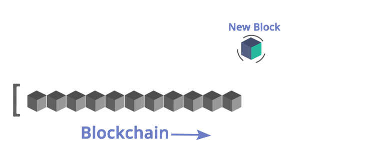

# Private Blockchain



This project demonstrate familiarization with the fundamentals concepts of a Blockchain platform.
Concepts like:

    - Block
    - Blockchain
    - Wallet
    - Blockchain Identity
    - Digital Assests
    - Proof of Existance

## What problem is solved through this private Blockchain application?

An employer is trying to make a test of concept on how a Blockchain application can be implemented in his company.
He is an astronomy fans and he spend most of his free time on searching stars in the sky, that's why he would like
to create a test application that will allows him to register stars, and also some others of his friends can register stars
too but making sure the application know who owned each star.

### Employer Requirements

1. The application shall create a Genesis Block upon initializing the application.
2. The application shall validate if the block has been tampered or not.
3. The user will request the application to send a message to be signed using a Wallet and in this way verify the ownership over the wallet address. The message format will be: `<WALLET_ADRESS>:${new Date().getTime().toString().slice(0,-3)}:starRegistry`;     
4. Once the user have the message the user can use a Wallet to sign the message.
5. The user can try to submit the Star object for that it will submit: `wallet address`, `message`, `signature` and the `star` object with the star information.
    The Start information will be formed in this format:
    ```json
        "star": {
            "dec": "68° 52' 56.9",
            "ra": "16h 29m 1.0s",
            "story": "Testing the story 4"
		}
    ```
6. The application shall verify if the time elapsed from the request ownership and the time when you submit the star is less than 5 minutes.
7. If everything is okay the star information will be stored in the block and added to the `chain`.
8. The application shall retrieve the Star objects belonging to an owner (wallet address).
   - Return the Block with the hash passed as a parameter
   - Return array of Stars objects existing in the chain
9. Validate the whole Blockchain
   1. Each Block should be validated
   2. Each Block should be check the with the previousBlockHash to ensure continuity and integrity of Blockchain

## Tools and Technologies used

- This application is created using Node.js and Javascript programming language. The architecture uses ES6 classes
because it helps to organize the code and facilitate the maintnance of the code.
- Visual Studio Code as an IDE to write Private Blockchain code because it will help to debug the code easily
- Some of the libraries or npm modules used are:
    - "bitcoinjs-lib": "^4.0.3",
    - "bitcoinjs-message": "^2.0.0",
    - "body-parser": "^1.18.3",
    - "crypto-js": "^3.1.9-1",
    - "express": "^4.16.4",
    - "hex2ascii": "0.0.3",
    - "morgan": "^1.9.1"
    Remember if you need install any other library you will use `npm install <npm_module_name>`

Libraries purpose:

1. `bitcoinjs-lib` and `bitcoinjs-message`. Those libraries will help us to verify the wallet address ownership, we are going to use it to verify the signature.
2. `express` The REST Api created for the purpose of this project it is being created using Express.js framework.
3. `body-parser` this library will be used as middleware module for Express and will help us to read the json data submitted in a POST request.
4. `crypto-js` This module contain some of the most important cryotographic methods and will help us to create the block hash.
5. `hex2ascii` This library will help us to **decode** the data saved in the body of a Block.

## Understanding the Code

The code is a simple architecture for a Blockchain application, it includes a REST APIs application to expose the Blockchain application methods to the client applications or users.

1. `app.js` file. It contains the configuration and initialization of the REST Api.
2. `BlockchainController.js` file. It contains the routes of the REST Api. Those are the methods that expose the urls needed to call when making a request to the application.
3. `src` folder. It has the main two classes needed to create Blockchain application.

## Application Functionalities

To test this application [POSTMAN](https://www.postman.com/) is recommended to make the requests to the API.

1. Run the application using the command `node app.js`
You should see in your terminal a message indicating that the server is listening in port 8000:
> Server Listening for port: 8000

2. To make sure your application is working fine and it creates the Genesis Block you can use POSTMAN to request the Genesis block
3. Make your first request of ownership sending your wallet address:
4. Sign the message with your Wallet:
5. Submit your Star (digital asset)
6. Retrieve Stars owned by me

### Conclusion


